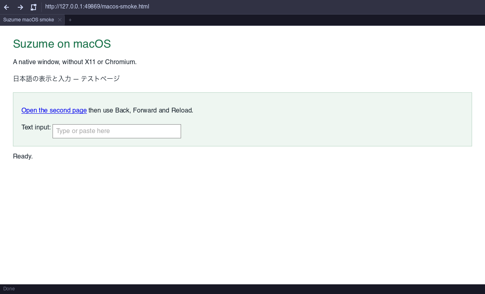

# suzume

[](https://ziglang.org)
[](LICENSE)
[](https://kernel.org)
[](docs/macos.md)

Lightweight GUI web browser written in Zig. Targets Raspberry Pi Zero 2W (512MB RAM, Cortex-A53).

> Experimental browser: a native macOS GUI is available, but modern-site
> compatibility and security boundaries still need work. QuickJS-ng
> (`SUZUME_JS=quickjs`) supports more JavaScript than the default kotori engine.
> Do not use sensitive accounts yet; see the documented limitations.

## Features

- **Self-implemented CSS engine** — tokenizer, parser, selectors, cascade (no LibCSS dependency)
- CSS custom properties (var()), calc(), clamp(), min()/max()
- CSS Grid layout with track sizing, spans, auto-placement
- Flexbox layout with wrap support
- Table layout with colspan, cellpadding, content-based column sizing
- ::before/::after pseudo-elements
- :link pseudo-class, CSS background propagation (spec-compliant)
- CSS transforms (translate), transitions, animations
- 120+ CSS properties, 200+ unit tests
- HTML5 parsing via lexbor
- **JavaScript engine** — kotori (self-implemented in Zig) + QuickJS-ng fallback
- Native AppKit window on macOS; X11/XCB on Linux (shared software renderer)
- Back/forward/reload toolbar, address selection and UTF-8-safe text editing
- macOS Command shortcuts, native menus, clipboard and IME text commits
- CoreText font discovery on macOS; Fontconfig on Linux
- FreeType + HarfBuzz text shaping (CJK support)
- Tab browsing, keyboard navigation, find-in-page
- Window resize with re-layout and media query re-evaluation
- Mouse wheel scrolling
- HTTP certificate-chain and hostname verification (no insecure retry)
- Compressed HTTP transfers and bounded conditional-response cache (8 MiB / 128 entries)

## Web Platform Tests (WPT)

Tested against the official [Web Platform Tests](https://github.com/web-platform-tests/wpt) suite:

| Area | Score | Subtests |
|------|-------|----------|
| reflection-forms | **99.9%** | 1577/1579 |
| css/css-box | **97.4%** | 299/307 |
| dom/lists | **93.1%** | 176/189 |
| html/dom | **89.1%** | 9529/10695 |
| dom/traversal | **83.7%** | 41/49 |
| dom/nodes | **80.2%** | 7538/9404 |
| dom/events | **75.5%** | 354/469 |
| dom/abort | **79.2%** | 19/24 |
| dom/ranges | **61.4%** | 8404/13689 |
| css/selectors | **56.4%** | 2220/3934 |

Selected test files at 100%: CharacterData (128/128), ChildNode (135/135), Element-classlist (1420/1420), Event-constructors.any (14/14), AddEventListenerOptions-once.any (4/4), EventTarget-constructible.any (3/3), DOMImplementation-hasFeature (137/137), Node-insertBefore (40/40).

### Running WPT

```bash
# First-time setup
bash tests/wpt/run_wpt.sh setup

# Run a test area with kotori (default)
bash tests/wpt/run_wpt.sh dom/nodes
bash tests/wpt/run_wpt.sh css/css-box
bash tests/wpt/run_wpt.sh html/dom

# Parallel runner also uses kotori by default
bash tests/wpt/run_wpt_parallel.sh --jobs 4 dom/nodes

# QuickJS fallback remains available for comparison/debugging
SUZUME_JS=quickjs bash tests/wpt/run_wpt.sh dom/nodes
```

## Building

Use **Zig 0.16.x**. The source uses its `std.Io` and `std.process.Init` APIs;
0.15 and 0.17 are not compatible.

### macOS (no XQuartz required)

```bash
git submodule update --init --recursive
brew bundle --file=Brewfile.macos
bash scripts/build-macos.sh
open zig-out/Suzume.app
```

The build creates `Suzume.app` and `Suzume-macos.zip`, bundles non-system dylibs,
and ad-hoc signs the application. It uses native system fonts without Fontconfig.
Apple Silicon is locally verified; Intel is supported by the build script but
not locally tested. See [macOS instructions and limitations](docs/macos.md).



### Linux / individual test targets

```bash
zig build -Doptimize=ReleaseSafe   # daily-use build (recommended)
zig build              # debug build (slow — for development only)
zig build run          # run browser
zig build test-css     # run CSS engine tests
zig build test-kotori      # run kotori JS engine tests
zig build test-kotori-dom  # run kotori DOM binding tests
zig build test-http-unit   # HTTP ownership/cache unit tests
zig build test-ui-input    # UTF-8 editing and selection
zig build test-text-fallback # CJK fallback (requires system Latin/CJK fonts)
zig build test-surface     # macOS RAM framebuffer colors and resize
python3 tests/http_regression.py  # offline HTTP/TLS integration tests (requires Python + OpenSSL)
```

> **Note:** the default `zig build` produces a Debug binary, which is
> dramatically slower (JS VM, layout, image decode). For actual browsing
> always build with `-Doptimize=ReleaseSafe`. ReleaseSafe is preferred over
> ReleaseFast because it keeps integer-cast/overflow checks (`@intCast` UB
> has bitten release builds before).

### Cross-compile for RPi Zero 2W (aarch64)

```bash
zig build -Dtarget=aarch64-linux-gnu.2.38 -Doptimize=ReleaseFast --search-prefix ~/suzume-sysroot/usr
```

### HTTP and WebSocket regression tests

`tests/http_regression.py` starts local HTTP and self-signed HTTPS fixtures; it
needs no external websites, display server, or renderer dependencies. It tests
compression, conditional GET/304 reuse, redirect header isolation, `no-store`,
`Vary`, binary POST bodies, TLS rejection, bounded cache memory, and allocation
failure cleanup, WebSocket frame metadata, and self-signed WSS rejection.
Run both configurations:

```bash
python3 tests/http_regression.py
python3 tests/http_regression.py -O ReleaseSafe
```

Set `ZIG=/path/to/zig-0.16.0` if necessary; extra arguments are passed to `zig test`.
For Homebrew curl, add `-I$(brew --prefix curl)/include -L$(brew --prefix curl)/lib`.
Curl builds without ws/wss explicitly skip two integration cases; macOS CI requires
all nine cases.
The HTTP, CSS, Linux build/input, and macOS build/renderer/input checks fail on
regressions. CSS testing now executes the actual suites (including CSSOM)
instead of silently passing zero tests: 363 tests pass in Debug and ReleaseSafe.
See [the development plan](docs/browser-roadmap.md) for remaining compatibility
and performance work.

## Architecture

```
src/
├── css/          # Self-implemented CSS engine (tokenizer, parser, selectors, cascade)
├── dom/          # DOM tree (lexbor wrapper)
├── layout/       # Layout engine (block, flex, grid, table, inline)
├── paint/        # Framebuffer painter (libnsfb)
├── js/           # JavaScript runtime (kotori engine + QuickJS-ng fallback)
├── net/          # HTTP loader (libcurl, SSL fallback)
├── ui/           # Browser chrome (tabs, address bar, input)
└── features/     # Adblock, config, storage, userscript
```

## JavaScript Engine

### kotori (default)

Self-implemented JS engine written in Zig. NaN-boxed values, bytecode compiler, stack-based VM.

- **Language** — var, function, closures, objects, arrays, strings, prototype chain, try-catch-throw
- **DOM API** — document.getElementById/querySelector/createElement, innerHTML/textContent, appendChild, style.*, addEventListener
- **DOM traversal** — parentNode, firstChild, nextSibling, children, childNodes
- **Selector matching** — #id, .class, tag, tag.class, tag#id combinations
- **Integration** — Inline `<script>` execution, DOM mutation detection, automatic re-render

```bash
./suzume https://example.com              # uses kotori (default)
SUZUME_JS=quickjs ./suzume https://example.com  # use QuickJS instead
```

### QuickJS-ng (fallback)

Full-featured ES2024 engine for complex sites. Activate with `SUZUME_JS=quickjs`.

- **ES2024 complete** — BigInt, private fields, top-level await, Array.at, Object.groupBy, etc.
- **ES Modules** — `<script type="module">`, import/export, HTTP-based module loader
- **DOM API** — querySelector, createElement, classList, innerHTML, MutationObserver, TreeWalker
- **Events** — addEventListener/removeEventListener, mouse/keyboard events, bubbling, composedPath
- **Networking** — fetch() with POST/headers/body, XMLHttpRequest, WebSocket (curl-based)
- **Workers** — Web Worker with separate QuickJS runtime per thread, postMessage/onmessage
- **Canvas 2D** — getContext('2d'), fillRect/clearRect/strokeRect, software pixel buffer
- **Storage** — localStorage, sessionStorage, persistent cookies (curl cookie engine)
- **Navigation** — location.assign/replace, history.pushState/back/forward, SPA routing
- **iframe** — Dynamic iframe with contentDocument/contentWindow, same-origin browsing contexts
- **Intl** — DateTimeFormat, NumberFormat, PluralRules, Collator, RelativeTimeFormat
- **Encoding** — TextEncoder/TextDecoder, atob/btoa, Blob, crypto.getRandomValues

## CSS Engine

The CSS engine is fully self-implemented in Zig with no external CSS library dependency:

- **Tokenizer** — CSS Syntax Level 3 compliant, zero-copy streaming
- **Parser** — Recursive descent producing stylesheet AST with shorthand expansion
- **Selectors** — Right-to-left matching with rule index and bloom filter optimization
- **Cascade** — Full cascade ordering (UA/author/inline), specificity, style sharing cache
- **Properties** — 120+ properties with color, length, percentage, calc() parsing
- **Variables** — CSS custom properties with var() resolution and cycle detection
- **Media queries** — @media with width, height, prefers-color-scheme
- **Transitions/Animations** — CSS transitions with event dispatch, @keyframes animations

## License

MIT

## Disclaimer
This project uses AI-generated code (LLM). I do my best to review and test it, but I can't guarantee it's perfect. Please use it at your own risk.\n
